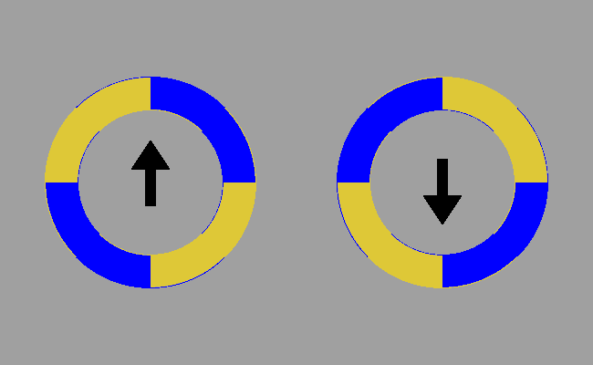

# Rotating Circles Optical Illusion

This project generates a clean version of a visual illusion involving rotating circles and arrows. The animation demonstrates how the perception of motion can be influenced by visual cues. Specifically, the arrows inside the circles change direction, which creates an illusion that the circles themselves are moving or rotating in different ways, even though their actual motion (if any) might be simple rotation or oscillation.

This repository was created to produce a high-quality, programmatic version of this specific animation.

## Generated Output



## Usage

To generate the animation yourself, you need to have [Go](https://go.dev/) installed.

1.  Clone the repository.

2.  Run the program:
    ```bash
    go run main.go
    ```

3.  The output will be saved as `out.gif` in the current directory.

## Development

The project uses the `github.com/fogleman/gg` library for graphics rendering.

To update dependencies:
```bash
go get -u
go mod tidy
```
